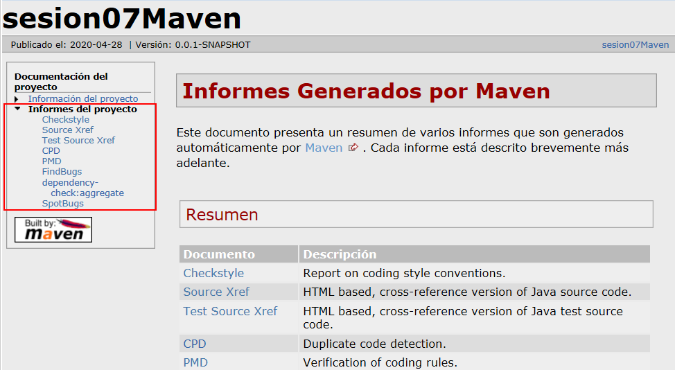
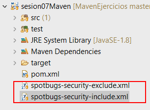

# MavenEjercicios

    

Recomendación de proceder en esta práctica:
1. Clona este repositorio en tu PC, y prueba que se construya correctamente en tu Eclipse, ejecutando los goals `clean package`. 
    - Debes configurar correctamente JDK en tu Eclipse tal y como se explica en el guión. Aunque se recomienda JDK8, también funciona con JDK11 y JDK14 (aun no lo hemos validado con JDK13).
    - Para estar seguro de que todo ha ido bien, comprueba que se han ejecutado todos los tests y que en la carpeta `target/site/jacoco` se ha generado el informe de cobertura. 
    - Para comprobar que se generan correctamente los __informes de análisis estático de código__, ejecuta los goals `clean package site`. De esta manera se crea el informe completo `target/site/index.html`. En el enlace _informes del proyecto_ deben aparecer todos.

  
Si hay errores, el problema es de tu Eclipse: revisa la configuración de JDK.

2. Cuando funcione correctamente, abre el archivo `pom.xml` de este proyecto que tienes clonado y **copia el contenido** completo excepto las primeras lineas, es decir, desde la línea `<properties>` hasta el final, y pégalo en el archivo `pom.xml` de tu proyecto, reemplazando del contenido que tenías por este. Si lo prefieres, ve copiando bloque a bloque de `pom.xml` a medida que se explica en el guión. Pero ten en cuenta: 
    - No es recomendable escribir el código del archivo pom.xml a mano, porque la sintaxis XML es propensa a errores y Eclipse no comprueba gran parte de los errores que puedes cometer.
    - Tampoco es recomendable copiar los bloques de código desde el documento pdf del guión, ya que algunos caracteres no se copian bien del pdf a texto plano (como los guiones '-').
    - __IMPORTANTE__: no olvides copiar también en tu proyecto los archivos `spotbugs-security-exclude.xml` y `spotbugs-security-include.xml` en la carpeta raiz de tu proyecto, al mismo nivel del `pom.xml`. SpotBugs es la nueva versión de FindBugs, que incluye errores de seguridad. En el archivo `spotbugs-security-include.xml` aparecen los tipos de erorres que va a buscar, en principio solo los de seguridad, pero puedes confirgurarlo para que busque también los de correctitud, código malicioso, malas prácticas, etc, modificando la linea `Bug category`: 

    `<Bug category="SECURITY,MALICIOUS_CODE,CORRECTNESS,BAD_PRACTICE "/>`

3. Pruébalo poco a poco, es decir, ejecutando  los goals que se indican en cada paso del guión. Para los informes de análisis estático de código, como __FindBugs__, comprobarás que al ejecutar `clean package findbugs:findbugs` se genera el informe en formato XML en el archivo `target/findbugsXml.xml`, pero no se genera informe en formato HTML. Si deseas visualizar el informe de __Findbugs__ en formato HTML debes ejecutar los goals `clean package site`.